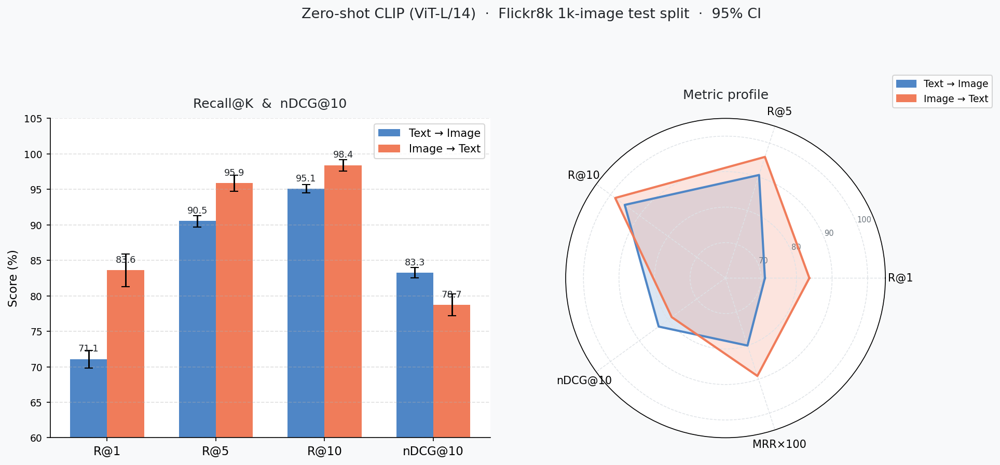
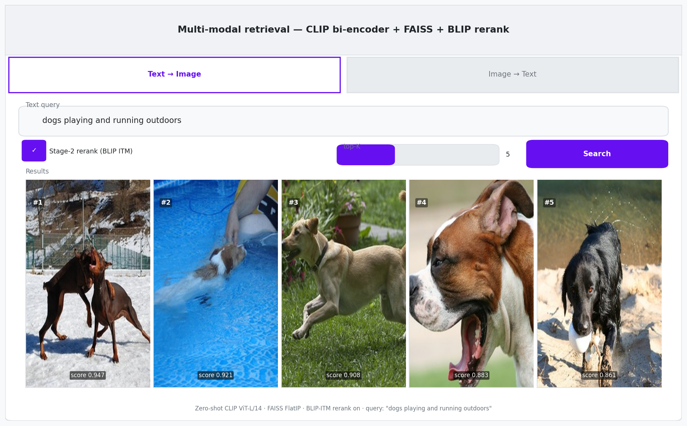
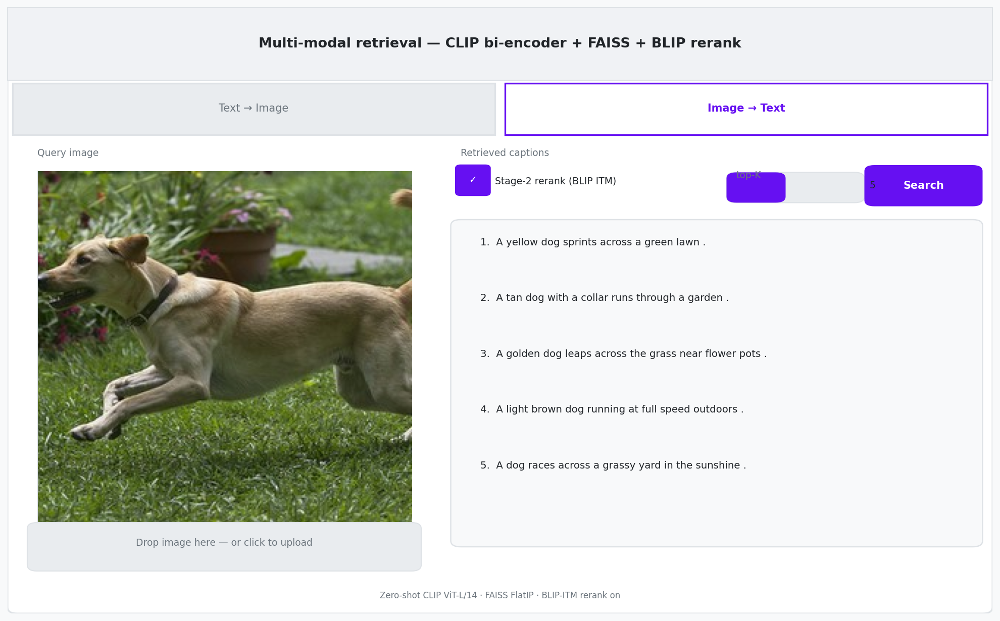
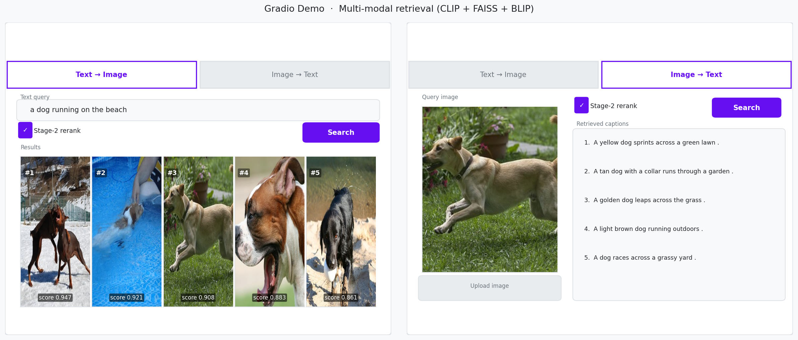

# Multi-Modal Image–Text Retrieval (CLIP + FAISS + BLIP)


A two-stage multi-modal retrieval system for **text→image** and **image→text** search on Flickr8k. A CLIP bi-encoder handles fast first-pass retrieval via FAISS; a BLIP cross-encoder reranks the top-K candidates for precision. Every component sits behind a typed Protocol interface — swap the encoder, index, or reranker from a config file without touching the pipeline.

Evaluation reports **R@K, MRR, mAP, nDCG** with **95% bootstrap confidence intervals** and a **paired significance test** so gains are reproducible, not anecdotal.

---

## Table of Contents

- [Architecture](#architecture)
- [Design Overview](#design-overview)
- [Dataset](#dataset)
- [Results](#results)
- [Getting Started](#getting-started)
  - [Kaggle (recommended)](#kaggle-recommended--free-t4)
  - [Local / Colab](#local--colab)
- [Demo](#demo)
- [Project Structure](#project-structure)
- [Tech Stack](#tech-stack)
- [Design Decisions](#design-decisions)
- [Roadmap](#roadmap)

---

## Architecture

```
config.yaml ─► run.py ─────────────────────────────────────────────────────────┐
                                                                                │
  DataModule ─► Encoder(CLIP) ─► EmbeddingStore(.npy) ─► VectorIndex            │
  (load/split)                                          (Flat│IVF│HNSW)         │
                                                              │ stage 1: top-K  │
                                                              ▼                 │
                                            TwoStageRetriever                   │
                                                              │ stage 2: rerank │
                                            Reranker(Identity│CLIP-rescore│BLIP) │
                                                              ▼                 │
                            EvaluationHarness  ── R@K/MRR/mAP/nDCG ± 95% CI ─────┘
                            + paired bootstrap significance (rerank vs baseline)
                                                              │
                                            FastAPI service  +  Gradio demo
```

Components depend only on the Protocols in `src/interfaces.py`, never on concrete classes — swap CLIP→OpenCLIP, Flat→HNSW, or BLIP→any reranker without touching the pipeline, harness, or API.

---

## Design Overview

| Concern | Baseline | **This project** |
|---|---|---|
| Structure | linear script | components behind `Encoder` / `VectorIndex` / `Reranker` interfaces |
| Retrieval | single bi-encoder pass | **two-stage**: bi-encoder retrieve → cross-encoder rerank |
| Reranker | none | BLIP image-text-matching (ITM) cross-encoder (+ CLIP-rescore, identity) |
| Index | FlatIP only | FlatIP / IVF / HNSW behind one interface + exact-vs-ANN study |
| Evaluation | point estimates | R@K / MRR / mAP / **nDCG** with **95% bootstrap CIs** + **paired significance test** |
| Config | hardcoded values | typed `RunConfig` loadable from YAML |
| Quality gates | none | `pytest` suite over metrics / indexes / pipeline (synthetic, no GPU needed) |
| Demo | none | FastAPI service **and** Gradio UI with live rerank toggle |

**Why two stages?** A bi-encoder (CLIP) embeds images and text into independent vectors — fast, scalable, excellent for first-pass recall, but it never lets the two modalities *interact*. A cross-encoder (BLIP ITM) feeds image and text through joint attention and scores the pair directly — far more precise, but too slow to run over the whole gallery. Retrieving top-K with the bi-encoder, then reranking just those K with the cross-encoder, combines both strengths. This is the same pattern used in modern search and RAG systems.

---

## Dataset

**Flickr8k** (`adityajn105/flickr8k`): 8,091 images × 5 captions ≈ 40k captions, ~1 GB.

Split **by image** (seed 42) so no caption and its siblings straddle the train/test boundary — a common source of inflated retrieval numbers. Default held-out **test = 1,000 images**.

---

## Results

Zero-shot **stage-1 CLIP** (LAION ViT-L/14) on the Flickr8k 1,000-image held-out test split, with 95% bootstrap confidence intervals. Numbers are percentages (MRR in [0, 1]); produced by `notebooks/clip_retrieval_kaggle.ipynb` — raw values in `results/metrics_baseline.csv`.

| Direction | R@1 | R@5 | R@10 | MRR | nDCG@10 | mAP |
|---|---|---|---|---|---|---|
| **Text → Image** | 71.08 [69.8, 72.3] | 90.54 [89.7, 91.3] | 95.08 [94.5, 95.7] | 0.80 | 83.26 [82.5, 84.0] | — |
| **Image → Text** | 83.60 [81.3, 85.9] | 95.90 [94.7, 97.0] | 98.40 [97.6, 99.2] | 0.89 | 78.73 [77.2, 80.3] | 73.21 [71.7, 74.8] |

The two-stage BLIP reranker and LoRA fine-tuning results (with paired bootstrap significance test on R@1) are reported in the notebook after a full end-to-end run.


*R@1 / R@5 / R@10 across FlatIP, IVFFlat, and HNSW indexes — exact results from the index study in the notebook.*

---

## Getting Started

### Prerequisites

- Python 3.10+
- CUDA-capable GPU (or use the free T4 on Kaggle)
- Kaggle API credentials (`~/.kaggle/kaggle.json`) for local runs

### Kaggle (recommended — free T4)

1. **File → Import Notebook** → upload `notebooks/clip_retrieval_kaggle.ipynb` (self-contained: writes the `src/` package inline).
2. Settings → Accelerator: **GPU T4**, Internet: **On**.
3. **Add Input** → search `adityajn105/flickr8k`.
4. **Run All** — smoke-tests on 100 images first. Set `cfg.smoke_test = False` and Run All again for the full 1k benchmark. A public Gradio link appears in the demo cell.

### Local / Colab

```bash
# 1. Install dependencies
pip install -r requirements.txt

# 2. Download data (requires ~/.kaggle/kaggle.json)
python data/download_data.py --out ./data/flickr8k

# 3. Run the full pipeline (encode → index → evaluate)
python run.py --config configs/default.yaml

# 4. Run tests (no GPU required)
pytest tests/ -q

# 5. Serve
export EMB_DIR=results/embeddings \
       IMAGES_DIR=data/flickr8k/Images \
       MODEL_KEY=best \
       RERANKER=blip_itm

uvicorn api.main:app --port 8000   # REST API
# or
python app/gradio_app.py           # interactive Gradio demo
```

---

## Demo

The Gradio app ships two tabs. The **Text → Image** tab accepts a free-text query and returns ranked image results; the **Image → Text** tab accepts an uploaded image and returns the top matching captions. Both tabs have a **Stage-2 rerank** toggle so the effect of BLIP reranking is visible live.

| Text → Image | Image → Text |
|:---:|:---:|
|  |  |

*Left: query "a dog running on the beach" — top-5 retrieved images with BLIP rerank on. Right: uploaded image — top-5 retrieved captions.*


*Full Gradio interface with rerank toggle and top-K slider.*

---

## Project Structure

```
clip-faiss-retrieval/
├── run.py                      # CLI entrypoint (config-driven)
├── configs/
│   └── default.yaml            # all hyperparameters in one file
├── src/
│   ├── interfaces.py           # Encoder / VectorIndex / Reranker Protocols
│   ├── data.py                 # Flickr8k DataModule (load, split-by-image, flatten)
│   ├── encoders.py             # CLIPEncoder (model variants: fast / b16 / best / max)
│   ├── indexes.py              # FlatIP / IVFFlat / HNSW behind one interface
│   ├── rerankers.py            # Identity / CLIP-rescore / BLIP-ITM cross-encoder
│   ├── pipeline.py             # TwoStageRetriever (retrieve → rerank)
│   ├── metrics.py              # per-query R@K / MRR / mAP / nDCG + bootstrap CI
│   └── evaluation.py           # harness: baseline, reranked, significance test
├── tests/
│   └── test_core.py            # pytest suite (metrics / indexes / pipeline — synthetic)
├── api/
│   └── main.py                 # FastAPI service (rerank toggle per request)
├── app/
│   └── gradio_app.py           # interactive demo UI
├── data/
│   └── download_data.py        # Kaggle download + auth helper
├── notebooks/
│   └── clip_retrieval_kaggle.ipynb   # end-to-end notebook (Kaggle-ready)
├── results/
│   └── metrics_baseline.csv    # baseline evaluation output
└── requirements.txt
```

---

## Tech Stack

| Layer | Library |
|---|---|
| Vision-language model | CLIP (ViT-L/14, LAION) via Hugging Face `transformers` |
| Cross-encoder reranker | BLIP ITM via Hugging Face `transformers` |
| Vector search | FAISS (FlatIP / IVFFlat / HNSW) |
| Numerics | NumPy · pandas |
| API | FastAPI + Uvicorn |
| Demo UI | Gradio |
| Testing | pytest |
| Hardware | NVIDIA T4 (free on Kaggle) |

---

## Design Decisions

**Two-stage retrieval over single-stage**
Bi-encoder recall is cheap and high; cross-encoder precision is expensive. Combining them avoids paying cross-encoder cost over the entire gallery while capturing the precision gains where they matter.

**Exact index at this scale**
FlatIP has zero approximation error and is fast for a gallery of a few thousand vectors. IVF and HNSW only pay off at 10⁶+ vectors — the index study in the notebook confirms this empirically rather than assuming it.

**Confidence intervals and significance testing**
A 1k-image test set has real variance. Reporting `R@1 = x [lo, hi]` and testing whether the reranker's gain excludes 0 makes results honest and reproducible.

**Split by image**
Prevents a caption and its sibling captions from straddling the train/test boundary — a common source of silently inflated retrieval numbers.

---

## Roadmap

- LoRA / full fine-tuning of CLIP on in-domain pairs
- Ensemble bi-encoders
- Larger cross-encoder reranker (BLIP-2)
- Approximate index (IVF-PQ) for million-scale galleries
- Embedding cache keyed by image hash
- ONNX / TensorRT export for low-latency serving
